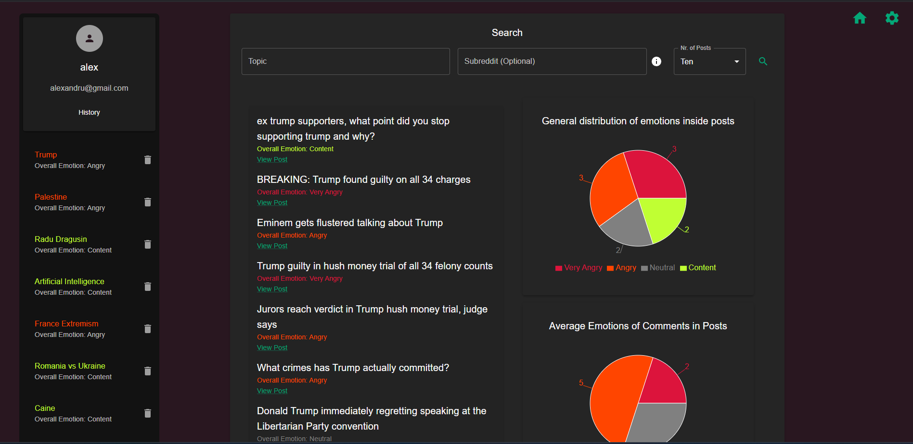

# Emotion Analysis and Visualization on Social Platforms

This project is a web-based application for analyzing and visualizing user emotions expressed on social media platforms, specifically Reddit. The solution aims to provide deeper insights into user sentiments beyond traditional binary classifications.

## Features

- **Sentiment Analysis:** Employs the NLTK library's VADER lexicon to analyze and classify sentiments with intensity levels.
- **Data Visualization:** Provides interactive visualizations using React.js and libraries like MaterialUI and Recharts.js.
- **Modular Architecture:** Divided into three main components:
  - **Content Extraction and Sentiment Analysis:** Fetches Reddit posts using PRAW and analyzes sentiments using AI methods.
  - **Data Persistence and Security:** Secures user data and ensures efficient communication between components using Spring Boot and MongoDB.
  - **User Interface:** A React-based frontend for user interaction and data visualization.

## Technologies

- **Backend:**
  - Spring Framework for API development and business logic.
  - MongoDB for data persistence.
  - Spring Security with JWT for authentication and authorization.
- **Frontend:**
  - React.js for the user interface.
  - MaterialUI and Recharts.js for UI components and data visualization.
- **Sentiment Analysis:**
  - NLTK's VADER lexicon for emotion extraction.
  - KMeans clustering for threshold determination.
- **Data Handling:**
  - PRAW for Reddit data extraction.
  - Custom preprocessing pipelines for sentiment analysis.

## Usage

1. **Authentication:**
   - Create an account or log in securely.
   - JWT tokens are used for session management.

2. **Search Topics:**
   - Users can specify topics and subreddits for analysis.
   - The system extracts posts and comments, processes their sentiment, and saves the results.

3. **Data Visualization:**
   - Sentiment trends and emotion classifications are displayed using interactive graphs.

4. **Customization:**
   - Users can edit account settings and view their history of analyzed topics.

## Future Enhancements

- Incorporate advanced machine learning models to improve sentiment classification accuracy.
- Expand support to additional social media platforms.
- Introduce real-time analytics capabilities.
